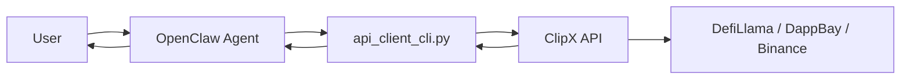
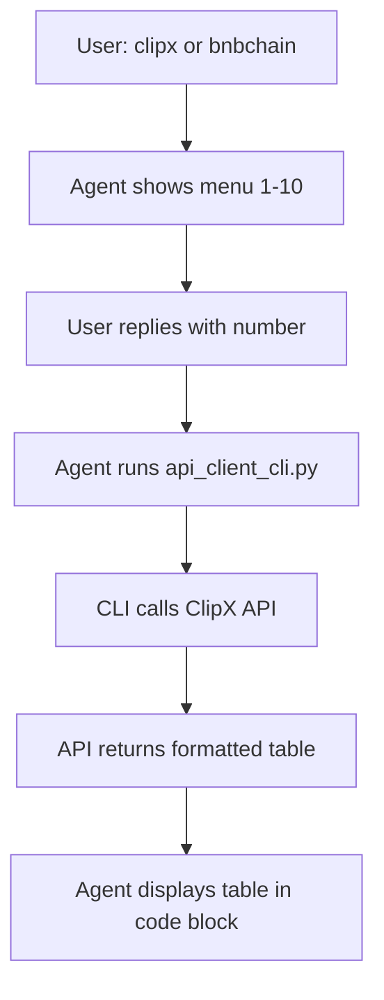

# ClipX Skills

> BNB Chain analytics for OpenClaw — TVL, fees, revenue, DApps, meme rank, and more. No API keys. No scraping on the client.

[](https://www.python.org/downloads/)
[](https://openclaw.ai)
[](https://bnbchain.org)

---

## Table of Contents

- [Overview](#overview)
- [Architecture](#architecture)
- [Workflow](#workflow)
- [Quick Start](#quick-start)
- [File Structure](#file-structure)
- [API Reference](#api-reference)
- [Configuration](#configuration)
- [Local Testing](#local-testing)
- [Server-Side API](#server-side-api)
- [Publishing to ClawHub](#publishing-to-clawhub)
- [Troubleshooting](#troubleshooting)

---

## Overview

**ClipX Skills** is a thin public client for the ClipX BNBChain API. It enables OpenClaw agents to fetch live BNB Smart Chain metrics and rankings via a simple CLI — no scraping logic, no Playwright, no API keys on the client.

### Features

| Category | Metrics |
|----------|---------|
| **Rankings** | TVL, fees, revenue, DApps, full ecosystem, social hype, meme rank, market insight |
| **Network** | Latest block, gas price, sync state, block stats, address balance |
| **Output** | Text-only JSON, pre-formatted tables, monospace code blocks |

### Design Principles

- **Thin client** — All scraping and analytics run on your private API. This skill only calls HTTP endpoints.
- **Text-only** — No images or binary data. Safe for Telegram, Discord, and text-based agents.
- **Zero secrets** — No API keys required. Configure `CLIPX_API_BASE` if you host your own API.

---

## Architecture



**Flow:** User says "clipx" or "bnbchain" → Agent runs `api_client_cli.py` → CLI calls ClipX API (VPS) → API fetches from DefiLlama, DappBay, Binance → Returns JSON/formatted table → Agent displays result.

---

## Workflow

### Interactive Menu Flow



### Menu Options

| # | Analysis | Description |
|---|----------|-------------|
| 1 | TVL Rank | Top 10 protocols by Total Value Locked |
| 2 | Fees Rank | Top 10 by fees paid (24h/7d/30d) |
| 3 | Revenue Rank | Top 10 by revenue (24h/7d/30d) |
| 4 | DApps Rank | Top 10 DApps by users (7d) |
| 5 | Full Ecosystem | DeFi, Games, Social, NFTs, AI, Infra, RWA leaders |
| 6 | Social Hype | Top 10 social hype tokens |
| 7 | Meme Rank | Top 10 meme tokens by score |
| 8 | Network metrics | Latest block, gas price, sync state |
| 9 | Market Insight | Binance 24h volume leaders (API snapshot) |
| 10 | Market Insight (Live) | Volume Leaders + Top Gainers + Top Losers (API snapshot) |

---

## Quick Start

### 1. Install dependencies

```bash
pip install -r requirements.txt
```

Only `requests` is required. No Playwright or heavy dependencies.

### 2. Configure API base URL (optional)

```bash
# Linux / macOS
export CLIPX_API_BASE="https://your-clipx-api.com"

# Windows PowerShell
$env:CLIPX_API_BASE = "https://your-clipx-api.com"
```

Default: `http://5.189.145.246:8000`

### 3. Publish to ClawHub

```bash
cd ClipX_Skills
clawhub publish . \
  --slug clipx-bnbchain-api-client \
  --name "ClipX BNBChain Metrics & Rankings (API Client)" \
  --version 1.0.0 \
  --tags latest,bnbchain,metrics,clipx
```

### 4. Use in OpenClaw

1. Install the skill from ClawHub.
2. Say **"clipx"** or **"bnbchain"**.
3. Agent shows numbered menu (1–10).
4. Reply with a number (e.g. `7` for meme rank, `10` for live Binance data).
5. Agent runs the command and displays the formatted table.

---

## File Structure

| File | Purpose |
|------|---------|
| `SKILL.md` | OpenClaw skill metadata and agent instructions. Defines menu format, table display rules, and command mapping. |
| `api_client_cli.py` | Thin HTTP client. Calls ClipX API and prints JSON or formatted table to stdout. |
| `format_box.py` | Optional helper for local testing. Reads JSON from stdin and prints box-style table. |
| `requirements.txt` | Python dependencies (`requests` only). |

---

## API Reference

### Modes

| Mode | Description | Example |
|------|-------------|---------|
| `metrics_basic` | Network status (block, gas, sync) | `--mode metrics_basic` |
| `metrics_block` | Block stats over N blocks | `--mode metrics_block --blocks 100` |
| `metrics_address` | Balance and tx count for address | `--mode metrics_address --address 0x...` |
| `clipx` | ClipX rankings (requires `--analysis-type`) | `--mode clipx --analysis-type tvl_rank` |

### ClipX Analysis Types

| Type | Interval | Description |
|------|----------|-------------|
| `tvl_rank` | — | Top protocols by TVL |
| `fees_rank` | 24h, 7d, 30d | Top by fees paid |
| `revenue_rank` | 24h, 7d, 30d | Top by revenue |
| `dapps_rank` | — | Top DApps by users (7d) |
| `fulleco` | — | Full ecosystem leaders |
| `social_hype` | 24 | Social hype tokens |
| `meme_rank` | 24 | Meme token scores |

### Parameters

| Parameter | Default | Description |
|-----------|---------|-------------|
| `--analysis-type` | (required for clipx) | One of the types above |
| `--interval` | 24h | Used by fees_rank, revenue_rank, social_hype, meme_rank |
| `--timezone` | UTC | Timestamp timezone |
| `--formatted` | default | Print server-formatted table |
| `--no-formatted` | — | Print raw JSON |

### Example Commands

```bash
# Core metrics
python api_client_cli.py --mode metrics_basic
python api_client_cli.py --mode metrics_block --blocks 100
python api_client_cli.py --mode metrics_address --address 0x0000000000000000000000000000000000000000

# ClipX rankings
python api_client_cli.py --mode clipx --analysis-type tvl_rank --timezone UTC
python api_client_cli.py --mode clipx --analysis-type fees_rank --interval 24h --timezone UTC
python api_client_cli.py --mode clipx --analysis-type meme_rank --interval 24 --timezone UTC
```

---

## Configuration

### Environment Variables

| Variable | Description |
|----------|-------------|
| `CLIPX_API_BASE` | Base URL for ClipX API (e.g. `https://api.clipx.app`). Overrides hard-coded default. |

### Platform-Specific Setup

**Linux / macOS:**
```bash
export CLIPX_API_BASE="https://your-api.com"
```

**Windows (PowerShell):**
```powershell
$env:CLIPX_API_BASE = "https://your-api.com"
```

**Windows (cmd):**
```cmd
set CLIPX_API_BASE=https://your-api.com
```

---

## Local Testing

### Using format_box.py

Fetch and format in one command:

```bash
python format_box.py --analysis-type tvl_rank
python format_box.py --analysis-type meme_rank --interval 24 --timezone UTC
python format_box.py --analysis-type fees_rank --interval 7d
```

Or pipe from the client:

```bash
python api_client_cli.py --mode clipx --analysis-type tvl_rank --timezone UTC | python format_box.py
```

When no `--analysis-type` is given, `format_box.py` reads JSON from stdin (UTF-8 or UTF-8 BOM).

---

## Server-Side API

This skill assumes a **private ClipX API** hosted separately. The API is not included in the ClawHub publish.

### Endpoints

| Endpoint | Description |
|----------|-------------|
| `GET /api/bnb/metrics/basic` | Network metrics |
| `GET /api/bnb/metrics/block-stats?blocks=N` | Block statistics |
| `GET /api/bnb/metrics/address?address=0x...` | Address balance and tx count |
| `GET /api/clipx/analysis?t=TYPE&interval=24h&tz=UTC` | ClipX rankings |

### Response Shape (ClipX Analysis)

```json
{
  "ok": true,
  "analysis_type": "tvl_rank",
  "timestamp": "2026-03-03T17:03:08.394Z",
  "caption": "...",
  "source": "@ClipX0_",
  "items": [
    {
      "rank": 1,
      "name": "PancakeSwap AMM",
      "category": "Dexs",
      "metric_label": "TVL",
      "metric_value": "$1.92B"
    }
  ],
  "meta": { "interval": "24h" }
}
```

On error: `{ "ok": false, "error": "Human-readable error" }`

---

## Publishing to ClawHub

From the `ClipX_Skills` folder:

```bash
clawhub publish . \
  --slug clipx-bnbchain-api-client \
  --name "ClipX BNBChain Metrics & Rankings (API Client)" \
  --version 1.0.0 \
  --tags latest,bnbchain,metrics,clipx
```

This publishes only the thin client and `SKILL.md`. Your API logic stays private.

---

## Troubleshooting

| Issue | Solution |
|-------|----------|
| Menu shows bullets (•) instead of numbers | Re-publish the skill: `clawhub publish .` |
| Table not in monospace | Agent should wrap output in triple backticks. Ensure SKILL.md is up to date. |
| HTTP read timeout | Default timeout is 180s. Long analyses (fulleco, social_hype) may take up to 3 minutes. |
| `Connection refused` or `Network error` | Check `CLIPX_API_BASE`. Ensure the API server is running and reachable. |
| `analysis-type required` | For clipx mode, always pass `--analysis-type` with a valid value. |

---

## License

This skill is provided as-is. The ClipX API and backend logic are maintained separately.
